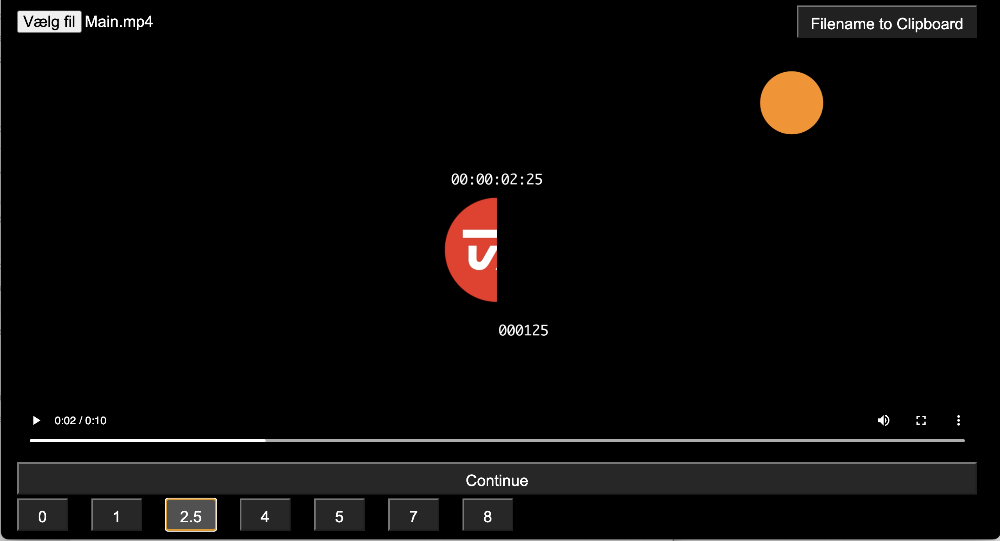

# step-gfx-player

Preview player for playing .mp4 videofile with timestamps from .xml file





## Releases:
Precompiled windows release are here:
[link to latest release](https://github.com/olzzon/step-gfx-player/releases/latest)

## Build and run:
Development running a dev-server:
```
yarn start
```

Build for production:

(Made as basic as possible so it only builds for host machine environment, e.g for a build for Windows, you need to build it on windows)
```
yarn make
```
